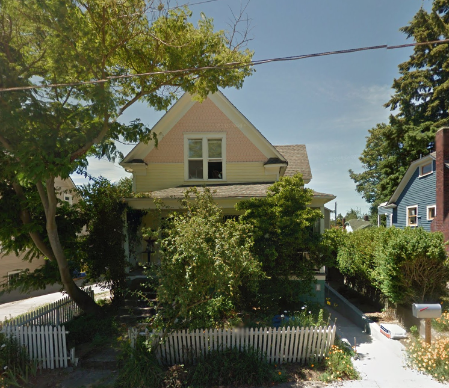

# Previsão de Preços de Imóveis em King County, WA

Este projeto de Machine Learning foi desenvolvido para o grupo de extensão **Perceptron** do CEFET Campus Leopoldina/MG. O objetivo é demonstrar como a regressão linear pode ser utilizada para prever o preço de imóveis com base em suas características.


## Visão Geral do Projeto

O notebook `Predictinghouseprices.ipynb` explora um conjunto de dados de vendas de casas em King County, Washington, EUA. Ele aborda desde a análise exploratória dos dados até a construção e avaliação de dois modelos de regressão linear:

1.  **Modelo Simples:** Utiliza apenas a área construída (`sqft_living`) como variável para prever o preço.
2.  **Modelo Múltiplo:** Incorpora múltiplas variáveis, como número de quartos, banheiros, e CEP, para aprimorar a precisão das previsões.

## O Conjunto de Dados

O arquivo `home_data.csv` contém os dados de vendas de imóveis. As principais colunas utilizadas no modelo são:

| Coluna | Descrição |
| --- | --- |
| `price` | Preço de venda do imóvel (nossa variável alvo) |
| `bedrooms` | Número de quartos |
| `bathrooms` | Número de banheiros |
| `sqft_living` | Área construída (em pés quadrados) |
| `sqft_lot` | Área do terreno (em pés quadrados) |
| `floors` | Número de andares |
| `zipcode` | CEP do imóvel |

## Como Utilizar

Para executar este projeto, siga os passos abaixo:

### Pré-requisitos

Certifique-se de que você tem o Python 3 e o Jupyter Notebook (ou JupyterLab) instalados. As seguintes bibliotecas são necessárias:

*   pandas
*   numpy
*   matplotlib
*   scikit-learn

Você pode instalar as dependências com o seguinte comando:

```bash
pip install pandas numpy matplotlib scikit-learn
```

### Executando o Notebook

1.  Clone ou baixe este repositório.
2.  Certifique-se de que o arquivo `home_data.csv` está no mesmo diretório que o notebook `Predictinghouseprices.ipynb`.
3.  Abra o terminal, navegue até o diretório do projeto e inicie o Jupyter:

    ```bash
    jupyter notebook
    ```

4.  No seu navegador, abra o arquivo `Predictinghouseprices.ipynb` e execute as células de código.

## Modelos e Avaliação

O notebook constrói e avalia dois modelos de regressão. A performance é medida pelo **Erro Quadrático Médio da Raiz (RMSE)**, que indica a diferença média entre os preços previstos e os preços reais.

*   **Modelo Simples (1 variável):** RMSE de aproximadamente $254.323,39
*   **Modelo Múltiplo (6 variáveis):** RMSE de aproximadamente $228.024,43

Como esperado, o modelo com mais características apresentou um erro menor, sendo, em média, mais preciso.

## Exemplos de Previsão

O notebook finaliza com a previsão de preços para três casas distintas:

1.  **Casa Comum:**

    

2.  **Casa de Luxo:**

    

3.  **Uma Mansão (a de Bill Gates):**

    

As previsões demonstram como os modelos se comportam para diferentes tipos de imóveis e destacam a importância da seleção de características para a precisão do modelo.

## Sobre o Perceptron

O **Perceptron** é um grupo de extensão do CEFET-MG Campus Leopoldina focado no estudo e desenvolvimento de projetos de Inteligência Artificial e Machine Learning. Nosso objetivo é capacitar os alunos e a comunidade, aplicando a teoria em problemas do mundo real.
